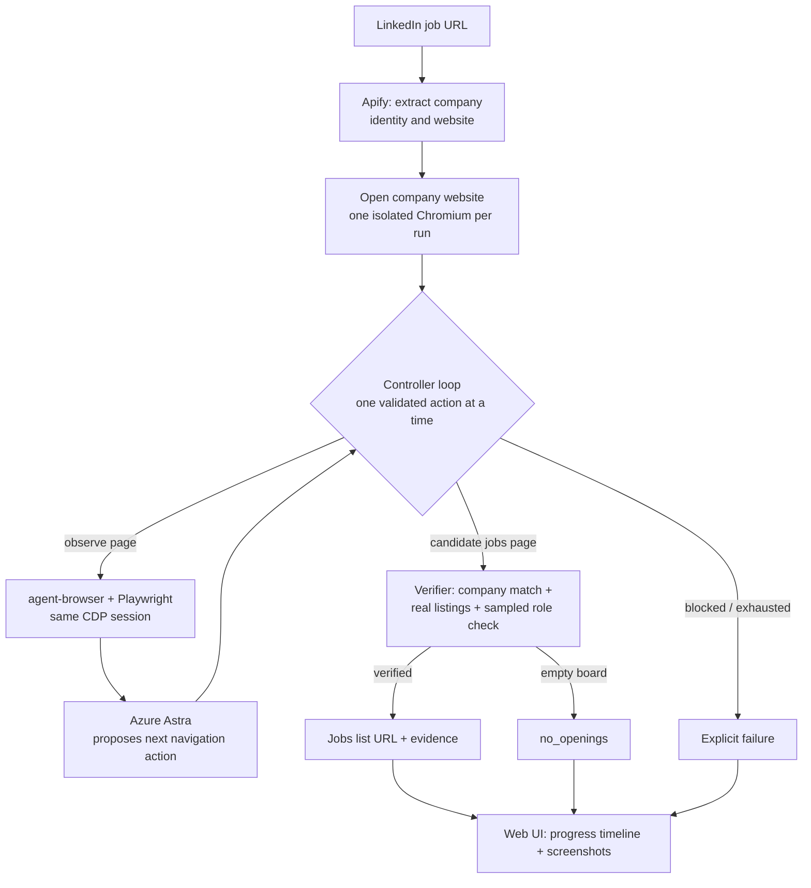

# Job Source Agent

Given a LinkedIn job-posting URL, the agent starts from the hiring company's own
website and navigates to that company's **actual jobs-list page** — returning a
working destination URL with browser evidence, or an explicit, honest failure.

A result counts as success only when the destination is verifiably the intended
company's and is a real listings collection — never a homepage, marketing page, or
a single job description. There is no company-to-careers mapping and no hard-coded
answer; every destination is reached by live navigation and independently verified.

> **Live demo:** [job-source-agent.apps.thalesops.com](https://job-source-agent.apps.thalesops.com/)

## Architecture



A FastAPI service wraps this loop with a SQLite run/event store, an artifact
directory for screenshots, and a small server-rendered UI with progress polling.

## Key design decisions

- **One browser, two clients, one session.** Each run owns a single isolated
  Chromium. agent-browser drives navigation (menus, scrolling, snapshots, tabs);
  Playwright attaches to the *same* process over CDP for rendered text, frames,
  links, and screenshots. Sharing one session avoids the state divergence of two
  independent browsers, and each client is used for what it does best.

- **The model proposes; the controller disposes.** Astra returns one structured
  action at a time from the current observation. The controller validates every
  action against observed references and discovered URLs, so the model can never
  invent a URL or an ATS tenant. Budgets, cycle detection (URL + content
  fingerprint), and bounded recovery keep runs finite and honest.

- **Verification is a gate, not a label.** A page is a success only with verbatim
  collection evidence, observed role titles and links, a company-identity match in
  the page/accessibility text or on the role page, and a sampled job-detail page
  that actually returns HTTP 200. An ATS hostname or a `/careers` path is never
  sufficient on its own. Explicit empty boards are reported as `no_openings`, not
  padded into the success rate.

- **Generic by construction.** No company- or ATS-specific selectors or mappings.
  The same logic reaches Workday, Greenhouse, Ashby, Lever, Personio, SmartRecruiters,
  Oracle HCM, and custom boards, across languages, because it reasons from rendered
  observations rather than site-specific rules.

- **Honest failures over false positives.** Removed/auth-walled postings, anti-bot
  walls, missing company websites, and navigation dead-ends each map to a distinct
  failure code with a reason. The agent never forces a destination to pass.

- **Safe by default.** Actions are limited to navigation and inspection — never
  applying, signing in, or submitting forms. An egress proxy resolves and pins
  public destination IPs and rejects private/local/metadata addresses, including on
  redirects. Untrusted page text is treated as data, never as instructions.

- **Simple, serialized runtime.** One Uvicorn worker with an in-process bounded
  queue serializes browser runs; SQLite persists state and marks in-flight runs
  interrupted after a restart. Concurrency is a later, measured change, not a default.

### Providers

- **Apify** — `piotrv1001/linkedin-job-details-scraper` reads the individual job;
  `harvestapi/linkedin-company` enriches the exact returned company profile, with
  `piotrv1001/linkedin-company-scraper` as a website fallback. Social-media profiles
  are rejected as company websites; source-linked URLs in the job description may be
  inspected and independently verified for company branding and domain association.
- **Astra** — Azure OpenAI v1 Responses API, strict structured navigation decisions
  and candidate-website identity checks.

## Run locally

Requirements: Python 3.12+, [uv](https://docs.astral.sh/uv/), Node.js 24+,
agent-browser 0.33.2, and Chrome/Chromium.

```bash
uv sync --frozen
npm install -g agent-browser@0.33.2
uv run playwright install chromium
```

Create `.env` from `.env.example` and keep credentials local:

```dotenv
AZURE_OPENAI_BASE_URL=https://YOUR-RESOURCE.services.ai.azure.com/openai/v1/
AZURE_OPENAI_MODEL=gpt-6-astra
AZURE_OPENAI_API_KEY=YOUR_KEY
APIFY_API_TOKEN=YOUR_TOKEN
```

```bash
uv run python -m scripts.check_config
uv run uvicorn app.main:app --host 127.0.0.1 --port 8000 --workers 1
```

Open **http://127.0.0.1:8000**. Project `.env` values take precedence over inherited
environment variables locally; restart the server after changing `.env`.

### Checks

```bash
uv run ruff check .
uv run pytest -q          # 107 tests: mocked providers + real local browser fixtures
uv run python -m scripts.run_local https://www.linkedin.com/jobs/view/4427787182/
```

The test suite uses mocked provider/model responses and real local Chromium
fixtures — no paid APIs. `run_local` and the smoke scripts call live services and
may consume credits.

## Deployment (ThalesOps, Dockerfile build)

```bash
docker compose up --build -d      # local: exposes 127.0.0.1:8000, persistent volume
```

The `Dockerfile` installs Node 24, pinned agent-browser, Python dependencies from
`uv.lock`, and Debian Chromium; it runs as a non-root user under an init process and
binds `0.0.0.0:8000`. In **ThalesOps**, choose the **Dockerfile** build method and:

1. Connect this repository as a separate application.
2. Set the four provider variables as runtime secrets (never baked into the image).
3. Route to container port **8000**, health check **`/healthz`**.
4. Mount persistent storage at **`/app/data`**, writable by UID **10001**.
5. Allow one active browser run with ~2 vCPU / 4 GB and adequate `/dev/shm`.
6. Let ThalesOps handle deployment, HTTPS, and hostname.

Chromium sandboxing is disabled inside the container for compatibility; keep the app
on an isolated container/host network. Only the HTTP port is exposed — CDP and the
egress proxy stay internal.

## Configuration

| Variable | Default |
|---|---|
| `DATA_DIR` | `data` |
| `RUN_TIMEOUT_SECONDS` | `300` |
| `MAX_ACTIONS` | `20` |
| `MAX_MODEL_CALLS` | `24` (including retries) |
| `MAX_QUEUE_SIZE` | `10` waiting runs |
| `REQUESTS_PER_HOUR` | `30` per client IP |
| `CHROMIUM_EXECUTABLE` | Auto-detect Playwright Chromium / local Chrome |
| `CHROMIUM_NO_SANDBOX` | `false` locally; `true` in Docker |

The run deadline covers API and browser work. Apify actor starts are not retried
automatically (that could duplicate charges); transient GET/model failures have
bounded retries.

## API

- `POST /api/runs` with `{"url": "https://www.linkedin.com/jobs/view/.../"}` → run ID.
- `GET /api/runs/{id}` → status, extracted identity, evidence, usage, and result.
  Results distinguish `careers_url`, `company_listings_url`, `jobs_url`, and
  `ats_resolution` (`following`, `verified`, `company_hosted`, `unverified`).
- `POST /api/runs/{id}/cancel` → cancellation request.
- `GET /api/runs/{id}/artifacts/step-01.png` → screenshot evidence.
- `GET /api/config` → configuration-presence check (no secret values).
- `GET /healthz` → liveness.

## Evaluation

Twenty LinkedIn URLs are sampled **before** any run — searches, seed, and checksums
recorded up front — so the test set is fixed and reproducible. The runner freezes
source/config hashes, keeps all twenty inputs in the denominator, and never swaps a
failed URL. Each success is manually adjudicated against its observed destination,
identity, navigation path, and listings.

Run a fresh evaluation:

```bash
uv run python -m evaluation.collect
uv run python -m evaluation.run
uv run python -m evaluation.report
```

The frozen held-out report is in [evaluation/results/REPORT.md](evaluation/results/REPORT.md);
the sampling method is in [evaluation/PROTOCOL.md](evaluation/PROTOCOL.md). See
[IMPLEMENTATION_PLAN.md](IMPLEMENTATION_PLAN.md) for design and milestones.

## Limitations

- Some company websites block automated access (Cloudflare, 403, Access-Denied).
  These are reported as `navigation_blocked`; the agent does not attempt to defeat
  bot detection.
- Extraction depends on a live, public LinkedIn posting. Removed, expired, or
  sign-in-gated jobs return `job_unavailable`.
- A company with no discoverable public website (or only a social profile) returns
  `website_missing` rather than a guessed domain.
- Recruiter/agency postings can be ambiguous about which vacancies are the hiring
  entity's own; these are adjudicated conservatively.

Semantic verification benefits from continued evaluation on fresh, unseen URLs. The
goal is truthful outcomes, not forcing every website to succeed.
